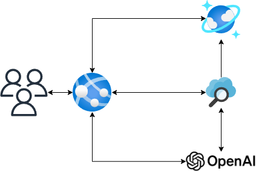
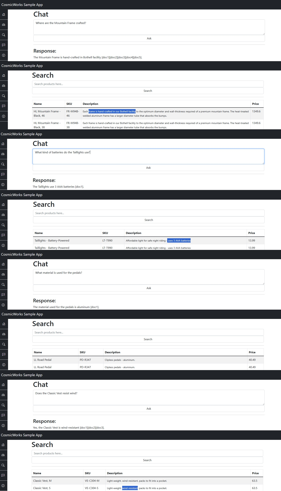

# CosmicWorks Sample App

Sample ASP.NET web application that consumes an Azure Cosmos DB (NoSQL), it connects to Azure Cognitive Search and Azure OpenAI with our own data (preview).

> Note: This project is an extension from the [azurecosmosdb/cosmicworks](https://github.com/azurecosmosdb/cosmicworks).

## Introduction

This sample application is for a ficticious company that manages an inventory of products (Bikes, Helmets, Accesories, etc). They created a web application to allow their customers and employees to search for information about these products. The web application embrace Azure Cognitive Search to provide a better search experience and  also Azure OpenAI to provide an innovative interaction by using the Chat to ask questions about its products powered by the OpenAI GPT Model with their own data.

## Diagram

## Features

This web applications demonstrates the following concepts:

* ASP.NET Razor Pages
* Azure Cosmos DB (NoSQL)
* Azure Cognitive Search working with Azure Cosmos DB
* Azure OpenAI working with Azure Cognitive Search
* Azure Web App Deployment with GitHub Actions

## Prerequisite

- To run this application you will need to have access to the Azure OpenAI Service, you can [apply here](https://aka.ms/oai/access).

> Note: The GPT Model limits the responses to the content from the Azure CosmosDB. 

## Sample Prompts

